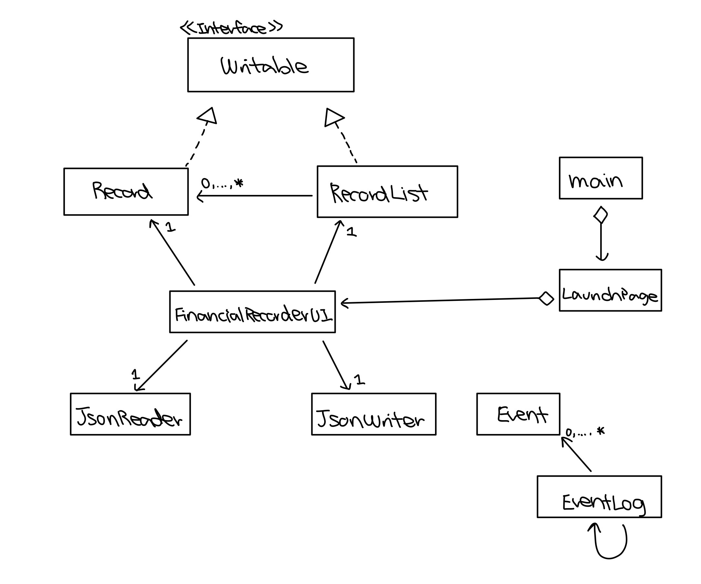

# My Personal Project

## Financial Recorder / Money Tracker

My project is a **Financial Recorder**. The **purpose** of this project is to record the user’s expenditures and income deposits. When a user input the date, store, product, price of the purchase or the money he/she earned, it is going to calculate how much money he/she have left. It can also be used as a tracker of the expenditures as there is an option to view all the records. It can be **used by people who want to keep track of their money and expenditures**, or simply by whom want to see how much money they have left. This project **interests me** because I must give one of these lists to my dad every month since he pays all my bills. It is sometimes very difficult to keep track of all the records and very time-consuming. Thus, if I can design a financial recorder myself, it would save me a lot of time and easier to use than the notebook on my phone.

This recorder can *keep track* of:
- Date of purchase/income deposit
- StoreName
- Purchased Product Name
- Price of the Product/Amount of money deposit
- Money left in account (remaining Balance)

## User Stories
- As a user, I want to be able to add expenditures and income records to my list
- As a user, I want to be able to delete added expenditures and incomes records from my list
- As a user, I want to be able to change a record in my list
- As a user, I want to be able to see how much money I have left
- As a user, I want to be able to see all the records that I have added

- As a user, I want to be able to save my record list to file
- As a user, I want to be able to be able to load my record list from file

## Phase 4: Task 2

Wed Mar 30 21:32:37 PDT 2022

New record added to record list

Wed Mar 30 21:32:40 PDT 2022

A record has been deleted from record list

## Phase 4: Task 3

If I had more time to work on the project, I would've made the LaunchPage class and the FinancialRecorderUI class one single class so that the diagram will look neater and easier to follow. This is because both classes are similar to each other as the launch page is just a Graphical User Interface that allows the user to input the current balance, which essentially could’ve been a method(initializeLanuchPage()) that is called at the constructor of the FinancialRecorderUI before the initializePage method. Other than simplifying the class, I also could’ve created abstract classes for the panels and buttons, as most of their layout is quite similar, and that can decrease the duplication of code and coupling.

